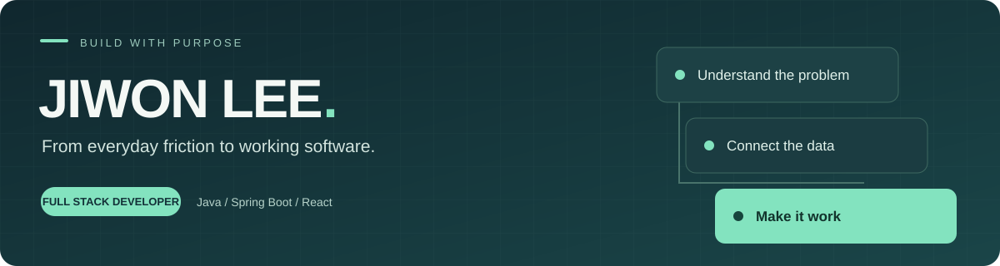

  

  Java · Spring Boot · React · TypeScript 

  <a href="mailto:jiwon0922@gmail.com">Email</a> &nbsp;·&nbsp;
  <a href="https://github.com/Koalaman0/einblick">einblick</a> &nbsp;·&nbsp;
  <a href="https://github.com/MLP-Ticketing-Master/ticketingMaster">Ticketing Master</a>

 

## Selected Projects

### 01 · [einblick](https://github.com/Koalaman0/einblick)
**의류 벤더를 위한 문서 데이터 처리·업무 자동화 서비스** · 개인 프로젝트

발주서 PDF와 ASSORT 엑셀을 파싱해 저장하고, 두 자료를 대조해 검토할 항목과 보고서를 제공

| 데이터 처리 | 검증과 결과 활용 |
| :--- | :--- |
| PDFBox 기반 PO PDF 파싱·등록 | 일치 / 불일치 / 확인필요 / 누락 분류 |
| Apache POI 기반 엑셀 업로드 | 수량·비율·고객사 패킹 기준 대조 |
| PostgreSQL 데이터 저장 | 대사 결과를 Word 보고서로 자동 생성 |

`Java` `Spring Boot` `React` `TypeScript` `PostgreSQL` `PDFBox` `Apache POI`

[Repository →](https://github.com/Koalaman0/einblick) &nbsp; [Service →](https://einblick-beta.vercel.app/)

 

### 02 · [티켓팅 마스터](https://github.com/MLP-Ticketing-Master/ticketingMaster)
**Redis 대기열·좌석 동시성 제어를 갖춘 e스포츠 예매 플랫폼** · 3인 팀 프로젝트

**담당:** 프론트엔드 전반 + 백엔드 관리자 기능 일부

- 공통 디자인 시스템, 회원가입·로그인, 예매 취소, 관리자 조회 화면 구현
- Axios 인터셉터 기반 JWT 자동 갱신과 Zustand 인증 상태 관리
- Spring Security CORS 설정을 통한 프런트엔드·백엔드 연동 문제 해결
- API 응답 형식 합의, Mock 데이터를 활용한 병행 개발과 코드 리뷰

`React` `TypeScript` `Zustand` `TanStack Query` `Spring Boot` `Oracle`

[Repository →](https://github.com/MLP-Ticketing-Master/ticketingMaster)

 

## Tech Stack

| 영역 | 프로젝트에서 사용한 기술 |
| :--- | :--- |
| **Backend** | Java · Spring Boot · Spring Security · JPA |
| **Frontend** | React · TypeScript · JavaScript · Tailwind CSS · Zustand · TanStack Query |
| **Data** | PostgreSQL · Oracle · SQL · Apache PDFBox · Apache POI |
| **Deploy & Tools** | Railway · Vercel · Git / GitHub · Figma |
| **팀 프로젝트 환경** | AWS EC2 · Docker Compose · Redis · Nginx |

 

<a href="mailto:jiwon0922@gmail.com">jiwon0922@gmail.com</a>

